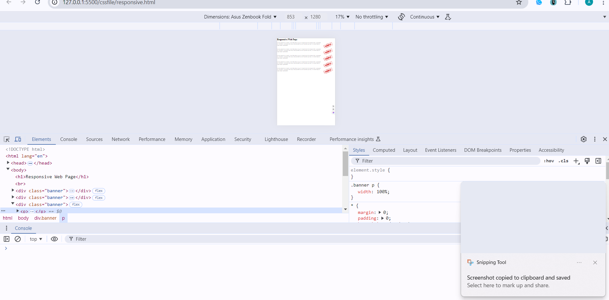

# HTML
# heading 1
## heading 2
### heading 3
#### heading 4
##### heading 5
###### heading 6
**Bold Text**

*Italic Text*

***Bold and Italic Text***
>Blockquote
>Blockquote

- List Item 1
- List Item 2
- List Item 3
- List Item 4
- List Item 5
- List Item 6

1. List Item 1
2. List Item 2
    1. List Item 1(a)
    2. List Item 1(b)
3. List Item 3
4. List Item 4
    - list 1
    - list 2
5. List Item 5

| Column1 | Column2 | Column3 |
|---------|---------|---------|
| Row 1   | Row 1   | Row 1   |
| Row 2   | Row 2   | Row 2   |
| Row 3   | Row 3   | Row 3   |

## Tips to remember
- Element
- Tag ->Attribute
- Attribute
- whenever opening a tag/symbol, immediately close it and come inside it to write the content.
- alt + down/up arrow to move line
- image with help of html 1-image, 2-figure, 3-picture
- with css-background image

# CSE
- Section A
  - Student 1
  - Student 2
  

# Naming Convetion

- hyphen-case
    - Css Property
    - Url
- camerlCase
- snake_case / underscore_case
- PascalCase
- lowercase
- UPPERCASE

# Content
-Title Case / Sentence Case

# JSON
- ""-> String "name":"joy"
- []-> Array "name": ["joy", "joe"]
- {}-> Obj

# TRUTHY
- if (true)
- if ({})
- if ([])
- if (42)
- if ("0")
- if ("false")
- if (new Date())
- if (-42)
- if (12n)
- if (3.14)
- if (-3.14)
- if (Infinity)
- if (-Infinity)